# 2025 Polish Presidential Elections: Electorate flows and anomalies

This short notebook analyses the results of the 2025 Polish Presidential election to address two questions:

* How did voters for first-round eliminated candidates vote in the run-off? How does this compare with exit poll results?
* Based on this, where can anomalies be detected in second-round voting?

To examine voter behaviour, I use simple OLS regression in four variants: with and without coefficient restrictions, and with and without random effects. The results broadly align with exit poll findings.

I then use fitted values to identify large residuals and detect anomalies, confirming those reported in previous studies. However, their scale is limited and unlikely to have influenced the final election outcome.

## Data

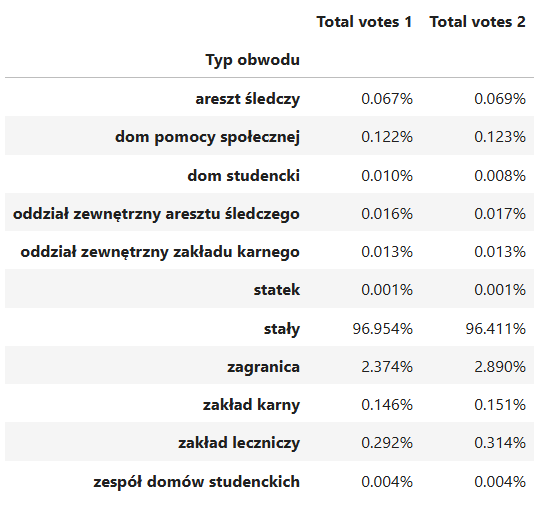

Above is the breakdown of voting districts by type. Nearly 97% are permanent (`stały`), which will be the focus of this study moving forward.

Districts abroad (`zagranica`) are excluded due to significant voter rotation caused by travel, making vote differences unrepresentative of actual electorate flows.

Other district types (e.g. `szpital`, `areszt`, `statek`) account for less than 1% of total votes. These cover small, specific populations—such as those in prisons, hospitals, or care homes—and are excluded to avoid distortion due to limited sample sizes.

Focusing solely on permanent districts ensures more stable and representative comparisons.

Finally, I exclude permanent districts with fewer than 100 valid votes. These represent just 0.15% of the total vote count in permanent districts and are removed for the same reason: small sample sizes can introduce noise and distort the analysis of electorate flows.

## Voting results in relevant data

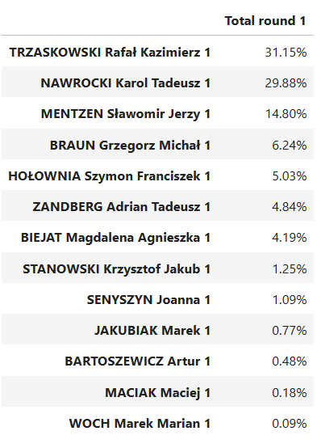

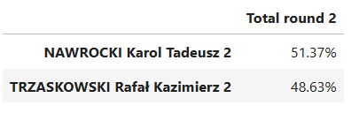

The cleaned dataset closely reflects the overall voting results. The only notable deviation is a slightly higher level of support for Nawrocki in the 2nd round of voting, which appears after excluding votes cast abroad. This is expected, as overseas voters tend to show different voting patterns compared to the domestic electorate.

## Generating clusters

The next step is to generate clusters for use in random effects models. The motivation behind clustering is that electorate flows—especially among those who did not vote in the first round—may vary significantly across different geographies. As using voivodeship (województwo) level clustering would not capture urban-rural differences in voting, while using county (powiat) level clustering would result in too small sample sizes (as there are over 370 of them in Poland) with many random effects very similar across powiats, I will use the following logic to generate the clusters:

- **Powiat Classification**  
  Each *powiat* (county-level unit, ~300,000 inhabitants on average) is assigned to one of four categories:
  - **Central**: A *miasto wojewódzkie* (voivodeship capital).
  - **Bordering**: A *powiat* bordering a Central one, often with significant commuter populations (especially around Warsaw). This category is not assigned in the Silesian voivodeship (województwo Śląskie) due to a sparse population distribution in the metropolitan area. 
  - **City**: A medium-sized urban area defined as *miasto na prawach powiatu* (city with powiat rights) which is not a Central city.
  - **Rural**: All remaining counties, typically more agricultural and less densely populated.

- **Cluster Assignment**  
  Each *powiat* category is then paired with its corresponding *województwo* (province-level unit, ~2.4 million inhabitants on average).  
  For example, *m. Warszawa* is classified as **Mazowieckie–Central**.

This hierarchical clustering approach ensures geographic and demographic relevance, improving the reliability of random effects estimates in later modelling.

**Powiat-level clusters**

`Min votes per cluster: 8,176 in sejneński`

`Min votes per cluster: 21 in Sopot`

**New clusters**

`Min votes per cluster: 50,500 in opolskie_Bordering`

`Min votes per cluster: 56 in warmińsko-mazurskie_City`

As shown, creating clusters instead of estimating random effects for each of the 370+ individual *powiats* significantly improves sample distribution. Specifically, the minimum sample size per group increases nearly threefold—from 21 to 56.

This enhances the reliability of random effects estimation by reducing noise and improving statistical robustness within each cluster.

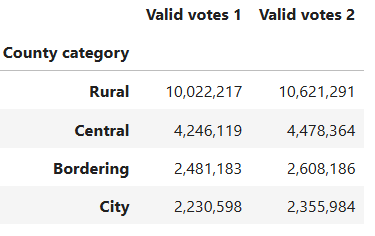

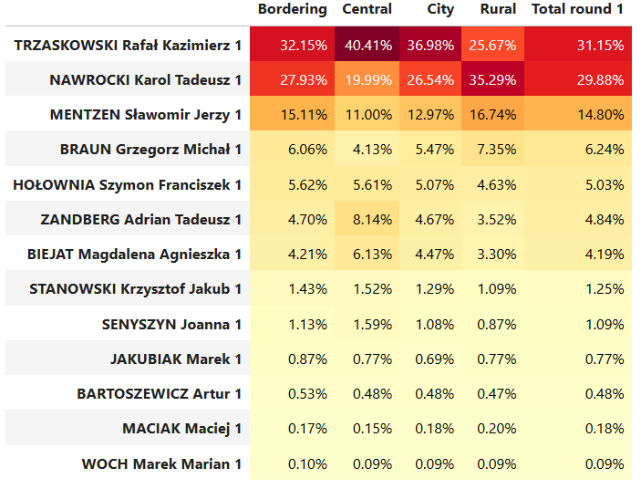

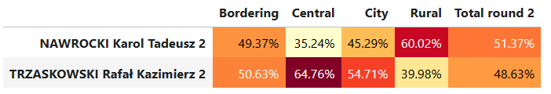

## Model

### Method 1: OLS

The first method estimates vote flows by regressing the second-round result of one candidate—Nawrocki (chosen arbitrarily, as his name appeared first on the ballot)—on the first-round results of all candidates, plus the number of new voters in each district.

To simplify the model and avoid overfitting, votes for the four lowest-polling first-round candidates are aggregated into a single category. Given their minimal support, this aggregation has no meaningful effect on the results.

The regression is estimated using heteroskedasticity-robust standard errors to account for potential variance differences across districts.

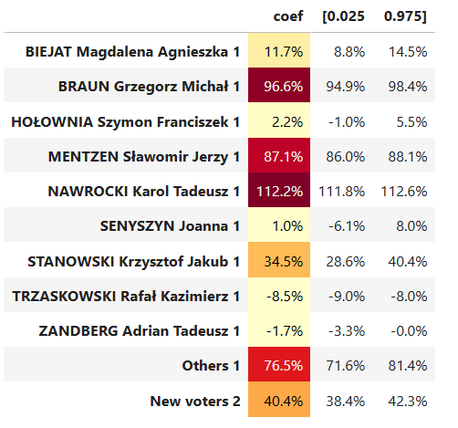

Observations from the Regression Results:
- For most candidates, the estimated vote flows align reasonably well with the exit poll results.
- However, the estimated flow from Adrian Zandberg voters and new voters to Nawrocki is notably lower than indicated by the exit poll.
- Additionally, some coefficients fall outside the rational bounds for vote shares:
  - A negative coefficient for Trzaskowski and Zandberg suggests an implausible vote shift *away* from Nawrocki.
  - A coefficient exceeding 100% for Nawrocki’s own first-round voters implies over-attribution, which is not feasible.

These anomalies point to limitations of the unconstrained OLS model, motivating further refinement using restrictions or random effects.

`Y_hat:  	10,290,479`

`Y:      	10,307,686`

`Abs error:  	17,207`

`Abs % error: 	0.167%`

`R2: 99.42%`

OLS estimates tend to fit the data well.

### Method 2: Restricted OLS

This approach follows the same logic as the standard OLS model but imposes natural constraints on the parameters: all coefficients are bounded between 0 and 1, reflecting valid proportions of vote flows.

Estimation is performed using a least squares technique with bounds, implemented via the `lsq_linear` module from `scipy`.

To account for uncertainty in the estimates, I compute confidence intervals using bootstrapping. This provides a more realistic measure of variability, especially in the presence of non-normal residuals or small sample sizes.

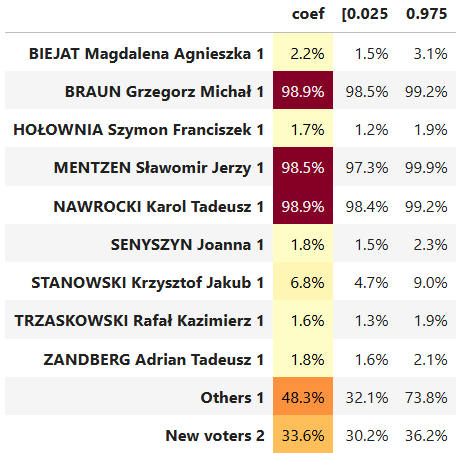

The estimated coefficients tend to cluster near the boundaries—either close to 0% or 100%—with few intermediate values. As a result, they often fail to reflect the more nuanced vote flows reported in the exit poll.

This outcome likely stems from the imposed constraints, which can push estimates to the extremes when multicollinearity or limited variation exists among predictors. While the model enforces logical bounds, it may oversimplify actual voter behaviour.

`Y_hat:  	10,213,826`

`Y:      	10,307,686`

`Abs error:  	93,860`

`Abs % error: 	0.911%`

`R2: 98.71%`

Although the R-squared remains relatively high, the fitted values still miss the actual result by nearly 100,000 votes—highlighting a substantial aggregate error.

This suggests that unobserved heterogeneity across regions may be influencing voting behaviour in ways not captured by the model.

To address this, I proceed to estimate a model with random effects, which allows for variation in vote flows across geographic clusters.

### Method 3: Random Effect OLS

In this approach, OLS coefficients are estimated separately within each geographic cluster. These cluster-specific estimates are then aggregated to form overall coefficients by weighting them according to the number of valid first-round votes in each cluster.

Standard errors are computed using a similar logic—assuming independence between clusters and heteroskedasticity within clusters.
  
$E[\theta_i] = \sum_c \theta_{ci}(n_c/N)$ 
$Std(\theta_i) = \sqrt{\sum_c Var(\theta_{ci})(n_c/N)^2}$  
Where 
$\theta_i$ is flow from candidate $i$ to Nawrocki 
$\theta_{ci}$ is from from candidate $i$ to Nawrocki in cluster $c$ 
$n_c$ is number of valid votes in round 1 in cluster $c$ 
$N$ is the total number of valid votes

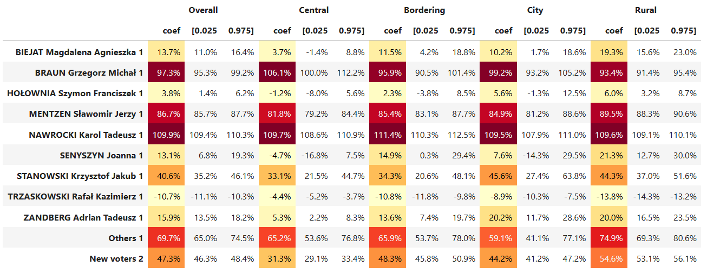

Several conclusions can be drawn from the cluster-weighted estimates:

- Coefficients for Zandberg, Senyszyn, and new voters are now much closer to exit poll results, suggesting better model calibration across regions.
- Estimates for Nawrocki and Trzaskowski still fall outside rational bounds (e.g. negative or >100%), indicating that even with clustering, some vote flows are not well identified.
- Voters of Mentzen, Senyszyn, Stanowski, Zandberg, and new voters were more likely to support Nawrocki in rural areas, highlighting significant regional patterns in voter behaviour.

These findings validate the use of random effects but also point to remaining modelling challenges, particularly in cases of strong candidate polarisation.

`Y_hat:  	10,314,918`

`Y:      	10,307,686`

`Abs error:  	7,232`

`Abs % error: 	0.070%`

`R2: 99.51%`

The absolute error has halved as well, further pointing to increased model accuracy.

### Method 4: Random Effects Restricted OLS

In the final approach, I estimate restricted OLS separately within each cluster. The overall coefficients are then computed by aggregating cluster-level estimates, weighted by the number of valid first-round votes in each cluster, analogous to the method used in the unrestricted random effects model.

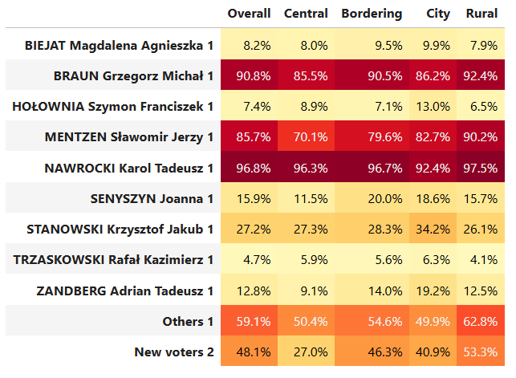

One slightly concerning outcome is that, even after enforcing rational constraints (coefficients between 0 and 1), the model suggests that approximately 3–5% of each runoff candidate’s first-round voters switched to the opponent in the second round. Given the short two-week interval between rounds, this level of defection appears relatively high and may reflect modelling limitations.

Compared to the random effects OLS model:
- The constrained model suggests fewer Stanowski and Biejat voters switched to Nawrocki.
- Conversely, it shows more Hołownia voters supporting Nawrocki in the second round.

These differences are noticeable but not dramatic, indicating general consistency across modelling approaches despite methodological differences.

`Y_hat:  	10,296,468`

`Y:      	10,307,686`

`Abs error:  	11,218`

`Abs % error: 	0.109%`

`R2: 98.82%`

The fit is quite close to RE OLS and significantly better than for restricted OLS without random effects.

## Summary

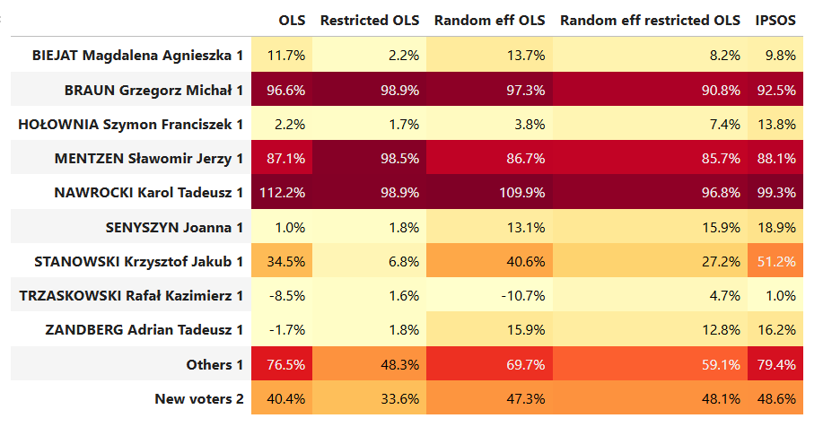

## Anomalies

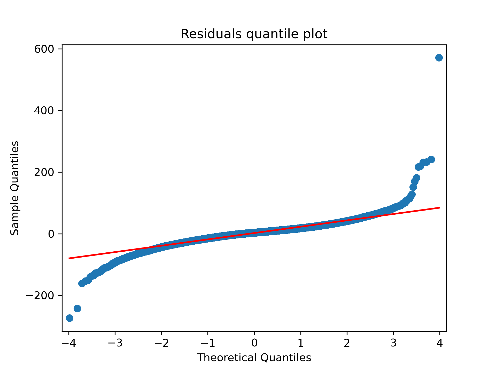

The quantile plot of residuals from the fourth model indicates a long-tailed distribution. This is not unexpected, as the model is unlikely to yield normally distribiuted residuals on such a micro-level of data. A small number of widely dispersed outliers are also present.

To explore these further, I identify districts where residuals have a z-score above 5, indicating statistically unusual deviations from the model's predictions.

- A **positive residual** means the model underpredicted votes for Nawrocki in that district.
- A **negative residual** indicates the model underpredicted votes for Trzaskowski.

These residuals do not imply irregularities by themselves but highlight areas where observed results differ most from model expectations.

`# districts where residual in-favour of Nawrocki has >5 z-score: 16`

`# districts where residual in-favour of Trzaskowski has >5 z-score: 30`

Out of over 29,000 permanent electoral districts in Poland, only 46 districts (approximately 0.15%) exhibited a residual absolute z-score above 5. While there were slightly more anomalies in favour of Trzaskowski, the difference is marginal relative to the total number of districts.

Given the small scale and balanced distribution of these anomalies, it is reasonable to conclude that they did not materially impact the final outcome of the election.

That said, the next step is to examine which specific districts these residuals occurred in, to better understand their geographic or administrative context.

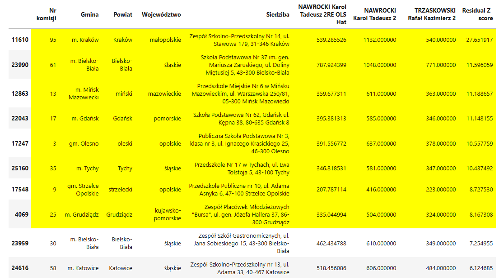

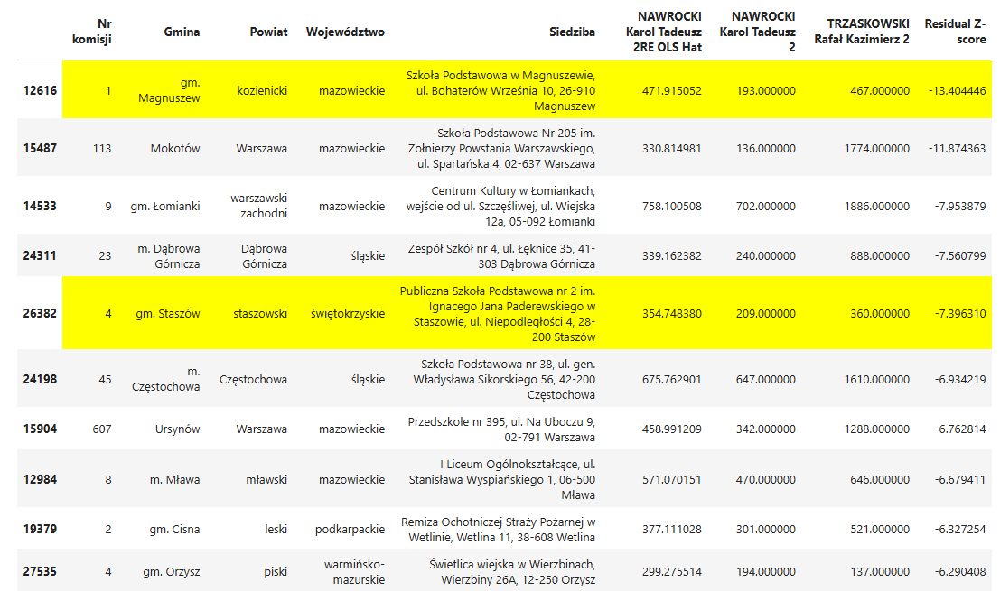

A quick review of the districts with the 10 largest absolute residual z-scores reveals that in several cases highlighted in yellow, there was a switch of votes between two candidates (i.e. candiadate A was assigned votes of candidate B). This pattern appears more frequently in favour of Nawrocki among the top residuals. However, in many cases, the cause of the discrepancy is less clear or not attributable to a specific source. While notable, those cases remain isolated instances and do not suggest a systemic bias.
